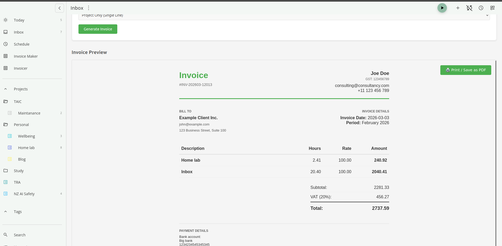

# Invoice maker plugin for Super Productivity

[All Releases](https://github.com/1jamesthompson1/sp-invoicer/releases)

[](https://github.com/1jamesthompson1/sp-invoicer/releases/latest)

[](assets/example.pdf)

> **⚠️ Early Development Warning**  
> This plugin is in early stages of development. **Always back up your Super Productivity data** before installing or updating this plugin. While the plugin syncs data across devices, we recommend regular exports of your client/invoice data until the plugin reaches a stable release.

## Features

- Generate client invoices from tracked time in Super Productivity
- Assign projects to clients with custom hourly rates and tax settings
- Flexible billing periods: week, month, year, custom date range
- Three itemization levels:
  - Project totals only
  - Main task breakdown
  - Nested parent/subtask hierarchy
- Tasks with identical names are automatically merged
- Export invoices as PDF
- Store invoice metadata (number, date, total, period) for reference
- Sync invoice details, client data, and project assignments across devices

## Get Started

### 1) Install the plugin

#### Option A: Install from a built ZIP
1. Download the [latest Release](https://github.com/1jamesthompson1/sp-invoicer/releases/latest) or build the plugin ZIP (`invoice-maker-vX.Y.Z.zip`).
2. In Super Productivity, open the plugin manager.
3. Choose install/load plugin from file.
4. Select the ZIP and enable the plugin.

#### Option B: Build it locally first
1. Clone this repository.
2. Run:

```bash
npm run build
```

3. Use the generated ZIP file and load it in Super Productivity.

### 2) Fill in your details

Open the plugin and go to **My Details**.

Add the information you want printed on invoices, for example:
- Name/business name
- Email, phone, address
- Tax ID label + Tax ID
- Bank/payment details
- Optional invoice title and closing message

Save your details before generating invoices.

### 3) Create your first client

Go to **Clients** and add at least one client with:
- Client name and contact details
- Hourly rate
- Tax name/rate (if applicable)

Each invoice is generated for one selected client.

### 4) Assign projects to a client

Go to **Projects** and assign each Super Productivity project to a client.

How it works:
- A project can be assigned to one client.
- Invoice generation uses these assignments to decide which tracked time belongs to which client.

Current limitation:
- Assigning directly from the project folder/project screen is not supported yet.
- Right now, assignments are managed only inside this plugin UI.

### 5) Generate an invoice

Go to **Generate Invoice** and:
1. Select a client.
2. Set invoice date.
3. Choose a billing period.
4. Choose itemization level.
5. Generate preview.
6. Print / Save as PDF.

The generated invoice info (id, amount, period etc) is also saved in the plugin’s **Invoices** tab when printed/saved. How not the invoice PDF itself.

## Contributing

*Note that this has been developed by a single person who is not very strong. Alot of the code is written by AI and may not be the most efficient or well-structured. Always happy to hear from people with more skills in this area.

### Development Setup

1. Clone the repository
2. Install dependencies (if any are added in the future)
3. Make your changes to the files in the `plugin/` directory

### Building

Build the plugin using:

```bash
npm run build
```

This will create a distributable version of the plugin.

### Automated Releases (GitHub)

This repo includes a GitHub Actions workflow at [.github/workflows/release.yml](.github/workflows/release.yml).

What it does:
- Triggers when you push a version tag like `v0.0.2`
- Runs `npm run build`
- Extracts release notes from `CHANGELOG.md`
- Creates a GitHub Release for that tag
- Publishes the release notes and uploads `dist/invoice-maker-vX.Y.Z.zip` as a release asset

How to publish a release:
1. Run `npm version patch` (or `minor`/`major`) - this creates a single commit with version, manifest, and changelog updates
2. Push commit and tag:

```bash
git push origin main --follow-tags
```

3. GitHub Actions automatically creates the release with the changelog notes and ZIP attachment.

Notes:
- `CHANGELOG.md` is automatically updated during `npm version` from your commit history
- Tag format must be `v*.*.*` (example: `v1.2.3`)

### Testing

To test the plugin in Super Productivity:

1. Build the plugin using `npm run build`
2. Load the built plugin file into Super Productivity
3. Test your changes

### Versioning

Version numbers are automatically synced between `package.json` and `plugin/manifest.json`. 

**To create a new version and release:**

1. Run `npm version patch` (or `minor`/`major`)
   - Updates `package.json` version
   - Syncs to `plugin/manifest.json`
   - Generates changelog entry in `CHANGELOG.md`
   - Creates a single git commit with all changes
   - Creates a version tag
2. Run `git push origin main --follow-tags`
   - Pushes code and tag to GitHub
   - Triggers the release workflow
   - Builds and publishes the ZIP with changelog notes

The `npm version` command includes lifecycle hooks that automatically sync manifest.json and update CHANGELOG.md before creating the version commit, so everything stays in sync with a single commit per release.

### Pull Requests

Contributions are welcome! Please feel free to submit a pull request.